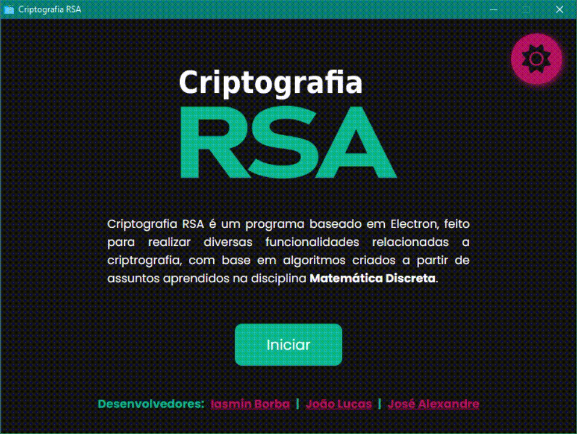
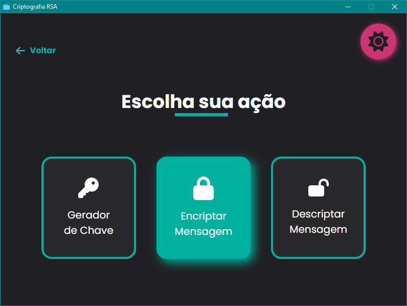
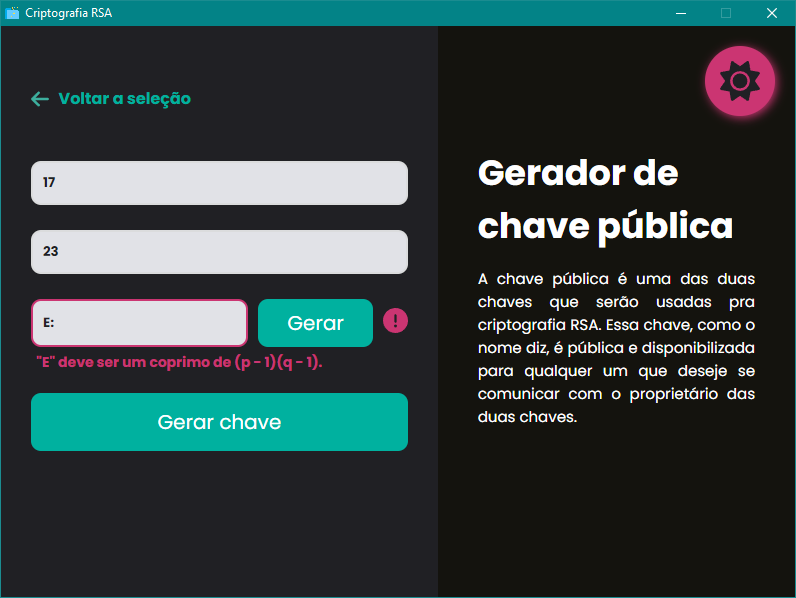
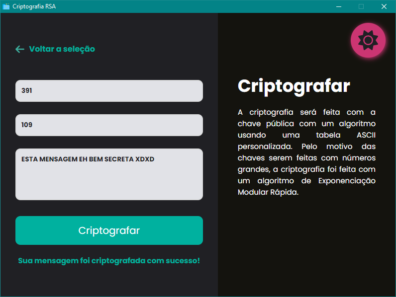
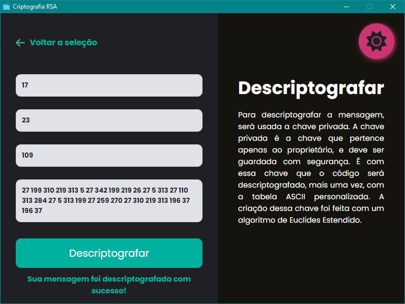
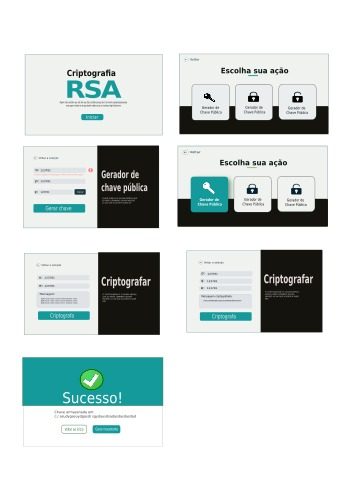

<br>
<div align="center">
  <p>
    
  </p>

# 🔐 Criptografia RSA, projeto de Matemática Discreta 👨‍🏫

</div>

<p align="center">
  
  
  <a href="https://github.com/abacaxiguy" target="_blank"></a>
</p>

<br>

<p align="center">
  
  
  
  
  
</p>

---

## 📥 Download

Você pode baixar a última versão do projeto [aqui](https://github.com/abacaxiguy/projeto-md/releases). A última versão inclui o executável para Windows, Linux e MacOS ✅.

Ou, se preferir, pode clonar o repositório e rodar o projeto localmente. Ensinamos logo abaixo 🔽.

---

## 🧪 Tecnologias

Este projeto foi desenvolvido utilizando as seguintes tecnologias e bibliotecas:

### 🎨 Frontend:

<a href="https://nodejs.org/" target="_blank">
</a>
<a href="https://axios-http.com/" target="_blank">
</a>
<a href="https://electronjs.org/" target="_blank">
</a>

### 🛠 Backend:

<a href="https://python.org/" target="_blank">
</a>
<a href="https://www.djangoproject.com/" target="_blank">
</a>

---

## 🚀 Como executar

Para rodar esse projeto na sua máquina local, primeiro clone este repositório e execute o comando:

```sh
  # Na raiz do projeto, instale as dependências
  npm install
```

Depois de instalar as dependências do frontend, você precisa instalar as dependências do backend. Para isso, vá até a pasta ``backend`` e execute o comando:

```sh
  # Na pasta backend, primeiro crie um ambiente virtual
  python -m venv env # ou python3 -m venv env, dependendo da sua versão do python

  # Depois, ative o ambiente virtual
  . env/bin/activate # ou env/Scripts/activate, dependendo do seu sistema operacional

  # Por fim, instale as dependências
  pip install -r requirements.txt
```

Depois de instalar todas as dependências, você pode rodar o projeto. Para isso, execute os seguintes comandos:

```sh
  # Primeiro, inicie o backend
  python manage.py runserver

  # Depois, em outro terminal, inicie o frontend
  npm start
```

🎉 Pronto! Agora você pode acessar o backend do projeto em [``http://localhost:8000``](http://localhost:8000), e o frontend já estará rodando em uma janela do seu desktop.

**⚠ Lembre-se, também, de preencher as credenciais necessárias em um arquivo ``.env`` usando o [``.env.example``](https://github.com/abacaxiguy/projeto-md/blob/main/.env.example) como um exemplo ⚠**

---

## 🏗️ Protótipo

O desgin desse projeto foi feito a partir do protótipo criado pelo [José Alexandre](https://github.com/ZanderAlec) que se encontra [aqui](./interfaces). Você pode vê-lo e comparar suas mudanças com o projeto final.

<br>

<div align="center">
  
</div>

<br>

---

## 🤝 Contribuições

Contribuições, issues e feature requests são muito bem vindas!<br />Sinta-se à vontade checar a [página de issues](https://github.com/abacaxiguy/projeto-md/issues).

---

## 📜 Licença

Copyright © 2023 [João Lucas](https://github.com/abacaxiguy) 🤝 [Iasmin Borba](https://github.com/IasminBorba) 🤝 [José Alexandre](https://github.com/ZanderAlec) .<br />
This project is licensed under the [MIT](https://github.com/abacaxiguy/projeto-md/blob/main/LICENSE) license.

---

## 👩‍💻 Desenvolvedores 👨‍💻

| [<br><sub>João Lucas</sub>](https://github.com/abacaxiguy) |  [<br><sub>Iasmin Borba</sub>](https://github.com/IasminBorba) | [<br><sub>José Alexandre</sub>](https://github.com/ZanderAlec) |
| :---: | :---: | :---: | 
